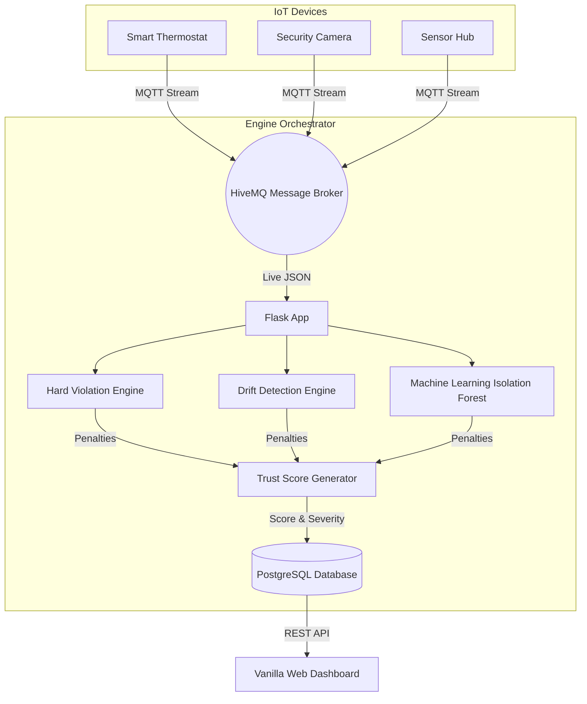

# 🛡️ TrustSphere - IoT Trust Analytics

**TrustSphere** is a live IoT Behavioral Trust Analytics platform designed to evaluate and dynamically map the security posture of thousands of interconnected devices across a network via Machine Learning mathematically. 

## 🏗️ Architecture



## ✨ Core Engines
1. **Hard Violation Engine**: Validates raw packets against deterministic security ceilings.
2. **Drift Detection Engine**: Computes normalized statistical shifts mathematically against previous standard behavior modes. 
3. **ML Anomaly Forest**: Leverages Scikit-Learn `IsolationForest` instances specifically mapped and modeled dynamically for *each individual device's* signature.
4. **Baseline Manager**: Controls observation windows dynamically. 

## 🚀 Setup & Installation (Local Development)

### 1. Requirements Installation
```bash
git clone https://github.com/sfiza12/trustsphere.git
cd trustsphere
pip install -r requirements.txt
```

### 2. Configuration (`config.yaml`)
By default, TrustSphere ships with a local `sqlite3` database engine mathematically mapped for instant plug-and-play validation. For production hardening, point `database_uri` to a PostgreSQL cluster (like Neon.tech).
```yaml
# In config.yaml
database_uri: "sqlite:///trustsphere.db" # Or postgresql://...
mqtt_broker: "broker.hivemq.com"
```

### 3. Launch Core Server
```bash
python app.py
```

### 4. Inject Mock Hackathon Traffic 
In a separate terminal, launch the `demo_publisher.py` to trigger live MQTT attacks against the system dynamically while you show the dashboard.
```bash
python scripts/demo_publisher.py
```

## 📡 API Endpoints 

| Method | Endpoint | Description | Auth Required |
|--------|----------|-------------|---------------|
| `GET` | `/api/devices` | Returns a compiled JSON list of all active systems sorted by vulnerability descending. | `Yes` |
| `GET` | `/api/device/<id>` | Grabs the temporal array metrics and the absolute raw telemetry batch associated with the target device. | `Yes` |
| `GET` | `/api/explain/<id>?view=current` | Returns the deeply nested JSON payload isolating precisely *why* a trust score was degraded mathematically. | `Yes` |
| `POST` | `/api/reset` | Purges the entire database tracking history sequentially (Admin Use Only). | `Yes` |

---
*Built securely for the Eclipse Hackathon dynamically.*